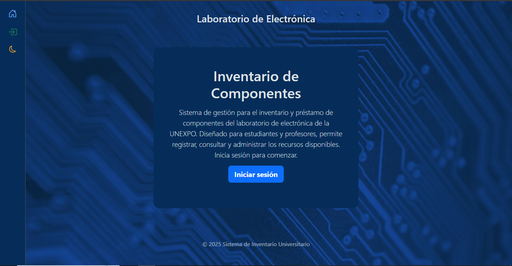
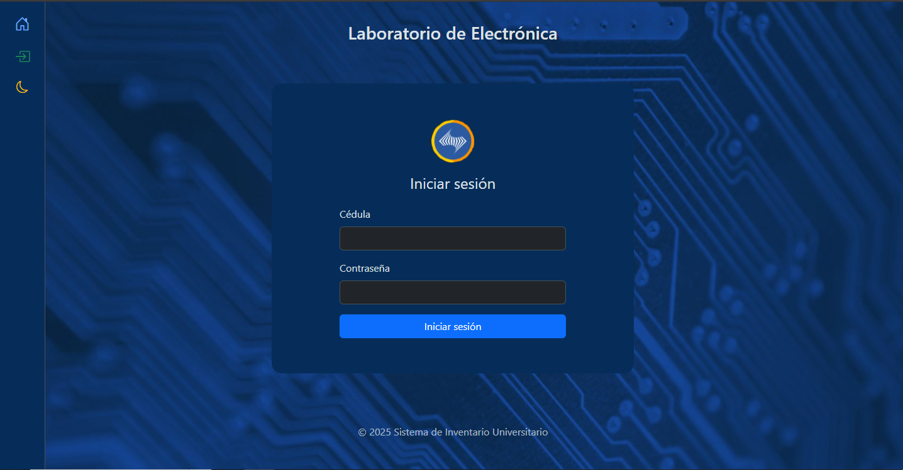
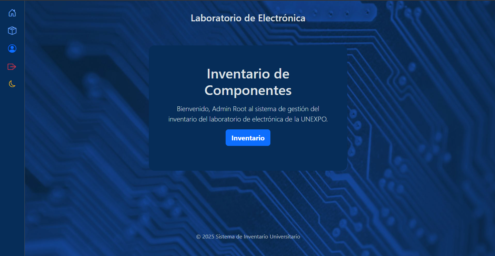
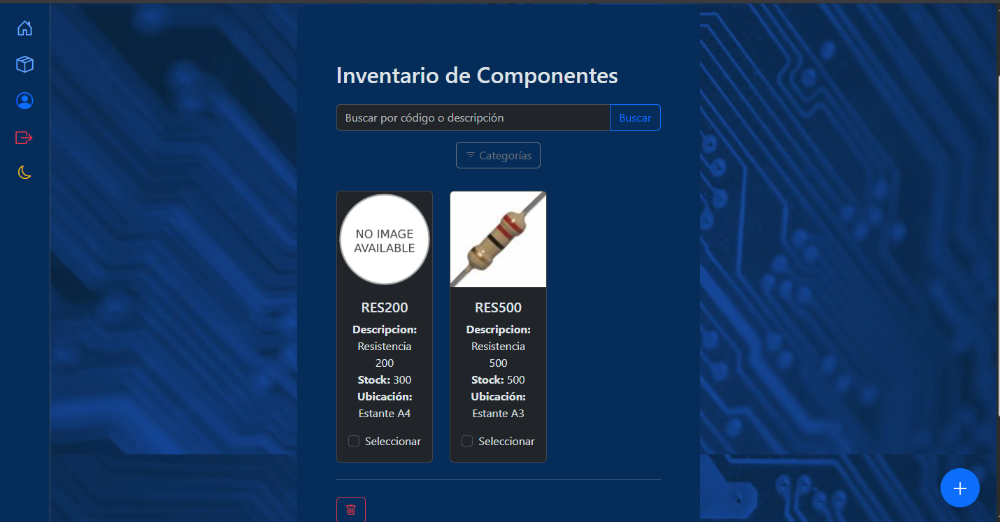
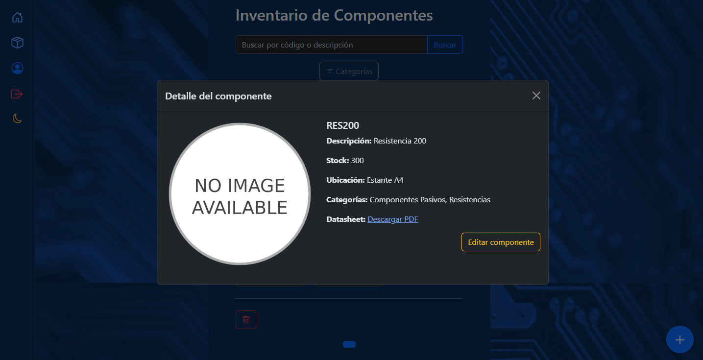
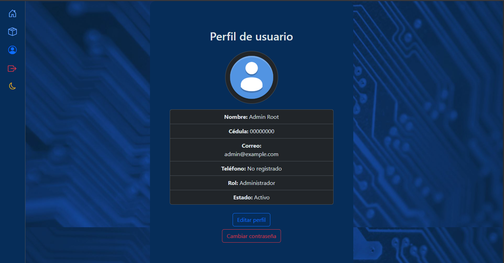
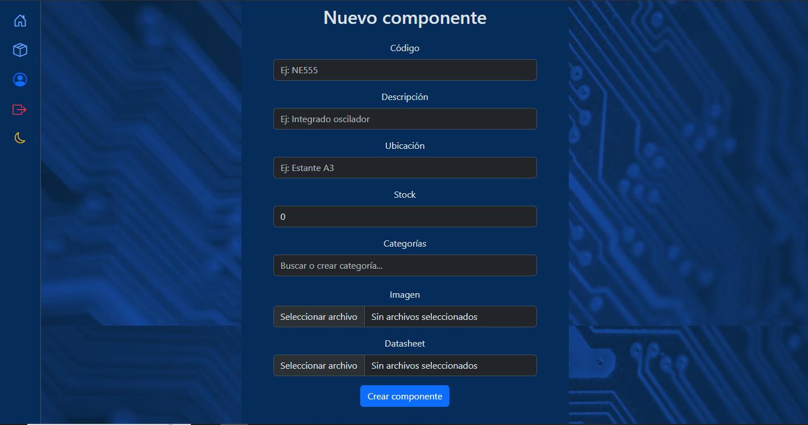
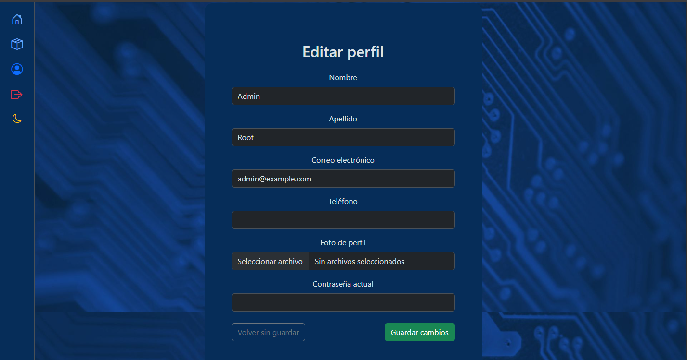

# Sistema de Gestión de Laboratorio Electrónico


Sistema completo para la gestión de inventario, usuarios y préstamos en laboratorios de electrónica universitaria. Permite a encargados administrar componentes y solicitudes, y a estudiantes consultar y solicitar materiales con seguimiento automatizado.

---

## Características Principales

- **Gestión de inventario avanzada** con categorización por tags
- **Edición visual de componentes** con validación por contraseña
- **Sistema de usuarios** con roles diferenciados y edición de perfil
- **Gestión de archivos** para imágenes y datasheets
- **Vista detallada con modal dinámico** para cada componente
- **Interfaz responsiva** con Bootstrap y templates HTML
- **Autenticación personalizada** con cédula como identificador

---

## Tecnologías Utilizadas

| Área           | Tecnologías                          |
|----------------|--------------------------------------|
| Frontend       | HTML, CSS, Bootstrap 5               |
| Backend        | Django 4.2 (Python)                  |
| Base de Datos  | SQLite 3                             |
| Autenticación  | Django Auth personalizado            |
| Almacenamiento | Sistema de archivos local (media/)   |

---

## Estructura del Proyecto

```
ElectronicLab/
├── ElectronicLabWeb/                  # Proyecto principal Django
│
│   ├── core/                          # Módulo base para vistas generales
│   │   ├── urls.py                    # Rutas para páginas públicas (ej. inicio)
│   │   ├── views.py                   # Vista de la página principal
│   │   └── templates/
│   │       └── core/
│   │           └── home.html          # Template de la página de inicio
│
│   ├── ElectronicLabWeb/              # Configuración global del proyecto
│   │   ├── asgi.py                    # Configuración para despliegue ASGI
│   │   ├── settings.py                # Configuración principal del proyecto
│   │   ├── urls.py                    # Enrutador raíz del proyecto
│   │   └── wsgi.py                    # Configuración para despliegue WSGI
│
│   ├── files/                         # Módulo para manejo de archivos
│   │   ├── admin.py                   # Configuración del admin para archivos
│   │   ├── models.py                  # Modelo FileRecord (imagen, PDF)
│   │   └── serializers.py             # API para guardar archivos desde formularios
│
│   ├── inventory/                     # Módulo de gestión de componentes
│   │   ├── admin.py                   # Configuración del admin para inventario
│   │   ├── models.py                  # Modelos: Componente, Categoría, etc.
│   │   ├── views.py                   # Vistas: CRUD, detalle, migración
│   │   ├── forms.py                   # Formularios de creación y edición
│   │   ├── urls.py                    # Rutas del módulo de inventario
│   │   ├── management/
│   │   │   └── commands/
│   │   │       └── clean_orphans.py   # Comando para limpiar archivos huérfanos
│   │   └── templates/
│   │       └── inventory/
│   │           ├── component_edit.html   # Template para editar componente
│   │           ├── component_form.html   # Template para crear componente
│   │           └── component_list.html   # Template para listar componentes
│
│   ├── static/                        # Archivos estáticos (CSS, JS, imágenes)
│   │   ├── css/
│   │   │   └── base.css               # Estilos base del proyecto
│   │   ├── img/
│   │   │   ├── bg-dark.jpg            # Fondo oscuro
│   │   │   ├── bg-light.jpg           # Fondo claro
│   │   │   ├── default-user.png       # Imagen por defecto de usuario
│   │   │   ├── no-image.png           # Imagen por defecto de componente
│   │   │   └── unexpo-logo.png        # Logo institucional
│   │   └── js/
│   │       ├── base.js                # Scripts generales
│   │       ├── componentDetail.js     # Modal dinámico de detalle de componente
│   │       ├── deleteModal.js         # Confirmación de eliminación
│   │       ├── editGuard.js           # Protección contra salida sin guardar
│   │       └── tagSelector.js         # Selector de categorías (tags)
│
│   ├── templates/                     # Templates compartidos
│   │   ├── base.html                  # Template base con estructura general
│   │   ├── navbar.html                # Barra de navegación superior
│   │   └── sidebar_items.html         # Íconos de navegación lateral
│
│   ├── users/                         # Módulo de gestión de usuarios
│   │   ├── admin.py                   # Configuración del admin para usuarios
│   │   ├── models.py                  # Modelo personalizado de usuario
│   │   ├── views.py                   # Vistas: login, logout, perfil, edición
│   │   ├── forms.py                   # Formularios de perfil y edición
│   │   ├── urls.py                    # Rutas del módulo de usuarios
│   │   ├── managers.py                # Manager personalizado para autenticación
│   │   └── templates/
│   │       └── users/
│   │           ├── login.html         # Vista de inicio de sesión
│   │           ├── profile_edit.html  # Vista para editar perfil
│   │           └── profile.html       # Vista del perfil del usuario
│
│   ├── .env                           # Variables de entorno (clave secreta, debug)
│   ├── db.sqlite3                     # Base de datos SQLite del proyecto
│   ├── manage.py                      # Script principal para comandos Django
│   └── requeriments.txt               # Lista de dependencias del proyecto
│
└── media/                             # Archivos subidos por los usuarios
    └── uploads/
        ├── originals                  # Archivos originales subidos
        ├── previews                   # Imágenes de vista previa
        └── thumbnails                 # Miniaturas generadas
```

---

### Entidades Principales

- **Usuario**: Cédula, nombre, apellido, email, telefono, rol, estado, foto
- **Componente**: Código, descripción, stock, ubicación, imagen, datasheet
- **Categoría**: Sistema de tags para clasificar componentes
- **Archivo**: Imagen o PDF vinculado a un componente o usuario

---

## Instalación y Configuración

### Requisitos Previos

- Python 3.9+
- pip
- SQLite (incluido por defecto)

### Pasos de Instalación

1. Clonar repositorio:
```bash
git clone https://github.com/Gardic-Coder/ElectronicLab.git
cd ElectronicLab
```

2. Configurar entorno:
```bash
# Crear y activar entorno virtual
python -m venv venv
source venv/bin/activate  # Linux/Mac)
venv\Scripts\activate    # Windows

# Instalar dependencias
pip install -r requirements.txt
```

3. Configurar variables de entorno:
- Crear archivo `.env` en la raíz del proyecto:
```ini
# Seguridad
SECRET_KEY=tu_clave_secreta
DEBUG=True
ALLOWED_HOSTS=localhost,127.0.0.1

# Base de datos
DB_ENGINE=django.db.backends.sqlite3
DB_NAME=db.sqlite3

# Archivos
MEDIA_URL=/media/
MEDIA_ROOT=tu_ruta_de_la_carpeta_media
ALLOWED_MIME_TYPES=image/jpeg,image/png,application/pdf
```

4. Inicializar base de datos:
```bash
python manage.py makemigrations
python manage.py migrate
```

5. Crear superusuario:
```bash
python manage.py createsuperuser
```

6. Ejecutar servidor:
```bash
python manage.py runserver
# O para poder probarlo tambien en moviles y otros dispositivos conectados a la misma red
python manage.py runserver 0.0.0.0:8000
```

---

## Estado Actual del Proyecto

### ✅ Funcionalidades Completadas

- Autenticación personalizada con cédula
- Edición de perfil con validación por contraseña
- CRUD completo de componentes
- Vista detallada con modal dinámico
- Carga y eliminación de imagen/datasheet
- Categorización por tags con buscador interactivo

### ⏳ En Progreso

- Solicitud y aprobación de préstamos
- Panel de efemérides técnicas

### 📅 Próximas Funcionalidades

- Registro de devoluciones y penalizaciones
- Auditoría de operaciones
- Notificaciones por email
- Dashboard con métricas
- Integración con sistemas universitarios
- App móvil complementaria

---

## Capturas de Pantalla

### 💻 Vista en PC

#### Home sin autenticar


#### Login


#### Home autenticado


#### Inventario


#### Detalle de componente


#### Perfil de usuario


#### Crear componente


#### Edición de perfil


---

### 📱 Vista en móvil

*(proximamente)*

---

## Licencia

Este proyecto está bajo la licencia [MIT](LICENSE).

---